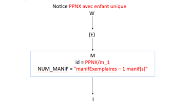
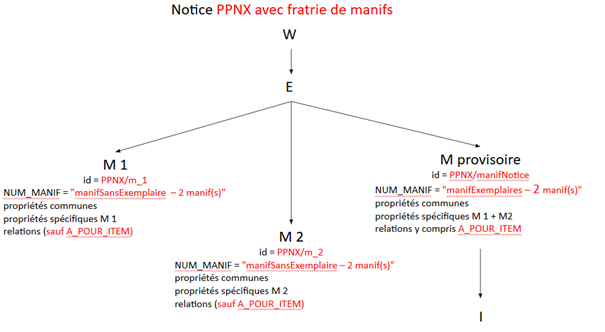
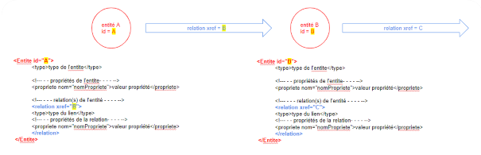

#  Documentation humaine de l’XSLT marc2pivot
 https://github.com/abes-esr/abes-format-pivot/blob/main/marc2pivot.xsl 

## Création du tronc OEMI
A partir de chaque notice MARC, on va créer à la racine du document XML pivot une enveloppe « WEMI » avec des variables globales qui vont nous servir tout au long du décorticage de la notice :

-          le type (électronique, imprimé ou autre)
-          le typePub (mono ou pub en série),
-          le typePubSerie (périodique ou collection)
-          la présence d’un lien à une notice Tr  (en B579$3) que nous considérons comme une « notice d’œuvre » 
-          le racineID, préfixe basé sur le PPN (de la Tr ou de la notice elle-même) qui va être décliné dans la construction des URI de toutes les entités créées.
-          nbManif qui calcule le nombre de manifestations identifiées au sein de la notice, à partir des ISBN et URL d’accès (B856) différentes mentionnées.

**Si nbManif = 1**, alors la manifestation sera nommée PPN/m_1 et la ou les entités Item lui seront liées.

**Si nbManif >1** : alors, on va créer autant de manifestations que d’identifiants différents détectés, plus une : la « manifNotice » qui va porter le lien à le ou les Items. En effet, les règles de catalogage ont fait que dans le Sudoc, on avait décidé de créer une seule notice pour des documents très proches, et il n’y pas d’informations qui permettent de lier avec certitude un Item à l’une ou l’autre des Manifestations créées.

_Illustration d’un cas de notice « cyprès » avec une seule Œuvre, une seule Expression, une seule Manifestation :_

_Illustration d’un cas où dans la notice, on détecte plusieurs Manifestations :_

 
Une fois que toutes les variables globales sont calculées, on commence à écrire.
Pour que de l’information portée au niveau notice puisse être retrouvée, l’enveloppe « WEMI » a deux propriétés :

- `ID_EXTERNE` qui contient tous les identifiants externes présents dans la notice (toutes les zones B035 concaténées)
- `META_NBMANIF` qui reprend la valeur de la variable globale calculée plus haut.

Ensuite, toutes les entités vont être créées sur un canevas générique avec

-          Un ID
-          Un ou plusieurs type(s), dont au moins un (et un seul) type LRM
-          Un bloc de métamétadonnées : `ID_SOURCE` (le PPN), `CITE_DANS` (lorsque l’ID n’est pas le PPN de la notice biblio – cf Exploitation des liens entre notices 4XX), `META_SOURCE` (le format de départ, ici MARC) et `META_ACTEUR` (XSLT-pivot)
Puis, des propriétés et des relations.

La première entité créée est l’entité « Œuvre ».

Les liens entre entités dans le pivot résultent :

-          soit de liens qui existaient déjà intégralement dans la notice MARC, vers des notices d’autorités qui utilisent des Idref comme identifiants.
-          soit de liens qui existaient déjà dans la notice MARC vers d’autres notices bibliographiques,
-          soit de liens que l’on crée au moment où l’on décompose les entités WEMI (par exemple, on crée à partir d’une notice unique au moins une œuvre, liée à une expression, liée à une manifestation, liée à un item).
 

 
Une relation n’a de sens que lorsqu’on dit vers quoi elle pointe : le pivot crée donc au moins un embryon d’entité pour que la relation puisse être exprimée entièrement. Si la relation pointe vers une autorité, on va utiliser l’URI IdRef pour la créer. S’il n’y a pas d’URI IdRef, cet embryon doit posséder au moins un identifiant, qu’on va construire sur la base du racineID (le PPN) auquel on rajoute des éléments basés sur des règles de nommage en fonction du type de la relation.

Chaque relation créée possède :

-          un type
-          des propriétés (dont toujours au moins le bloc de métamétadonnées : `META_SOURCE` (le format de départ, ici MARC) et `META_ACTEUR` (XSLT-pivot)

Une fois que l’XSLT a terminé la création de l’entité « Œuvre », vont être créées toutes les entités liées pour lesquelles on a un embryon (l’ID). 

## Exploitation des liens entre notices (zones B4XX)
Les notices bibliographiques sont déjà liées entre elles au moyen des zones 4XX du MARC. On a choisi de conserver une partie de ces liens (est traduit de, agrège/est agrégé dans, autre édition sur même ou autre support..). Quand on crée un embryon pour décrire la relation au sein de l’entité, on donne à cet embryon un ID basé sur le PPN de la notice citée, cible de la relation. Le PPN de la notice dans laquelle il est cité est rapatrié dans le bloc des métadonnées de gestion, dans la propriété CITE_DANS. Cette propriété conserve la mémoire de l’endroit où on a vu cette entité citée.

Selon la nature de l’information renseignée dans le lien 4XX, la relation peut être reportée au niveau Oeuvre, Expression ou Manifestation. La relation issue de 4XX est toujours au même niveau (d’une Oeuvre à une Oeuvre, d’une Expression à une Expression, d’une Manifestation à une Manifestation). 
 

## Cas particulier des propriétés sur les relations
On a prévu que le pivot puisse s’adapter d’une part à un fonctionnement type property graph ou RDF\*, et d’autre part à un fonctionnement classique où c’est une entité intermédiaire qui va porter la propriété. Les deux cas où nous avons des propriétés qui portent sur des relations sont :

-          le rôle dans la relation de contribution : `A_POUR_MENTION`
-          l’indexation sujet construite (RAMEAU) :  `A_POUR_INDEXATION`

On a dans le pivot ajouté un niveau en créant la réification. Dans les deux cas, l’entité intermédiaire est appelée « Contexte ».  
Pour l’indexation sujet, l’entité « Contexte » est typée `BOITE_SUJETS`. Cette dernière a comme relation : `A_POUR_SUJET_PRINCIPAL`, `A_POUR_SPECIFICATION_SUJET`, `A_POUR_SPECIFICATION_LIEU`, `A_POUR_SPECIFICATION_TEMPS`.

Pour les relations de contributions, l’entité « Contexte » est typée `CONTRIBUTION`.  Cette dernière a comme relation `A_POUR_MENTION_DE_CONTRIBUTEUR` qui pointe vers une entité de type Nomen.
 
Par ailleurs, pour les rôles et les affiliations ne sont pas traités de la même manière quand ils concernent des autorités (des entités Agent pour lesquelles on dispose d’une URI IdRef). Dans ce cas, le rôle est directement une propriété de la relation. Le pivot ne ménage donc pas dans ce cas de choix entre les deux fonctionnements. Il a fallu ainsi pour le POC2 recréer une entité intermédiaire dans l’XSL pivot2base.

## Exploitation des notices d’autorités de type TR

Dès l’abord d’une notice bibliographique, on a chargé une variable correspondant à l’existence d’un lien vers une notice d’autorité de type Tr (en zone B579). Ces notices d’autorités TR sont issues du processus de FRBRisation du Sudoc au moyen de l’AlgOCLC2.

S’il y a un lien, l’entité “Oeuvre” sera créée avec pour  `ID_SOURCE ` non pas le PPN qui est celui de la notice bibliographique traitée par l’XSLT, mais le PPN de la notice TR. Le PPN de la notice bibliographique sera mentionné dans la propriété  `CITE_DANS `.

Un
[Un XSLT différent](https://github.com/abes-esr/abes-format-pivot/blob/main/marc2pivot_TR.xsl) (marc2pivot_TR.xsl) va ensuite parser les informations des notices TR pour ajouter aux entités embryonnaires des propriétés (langue, résumé, indice Dewey, métadonnées de gestion) et des relations (aux entités de type Nomen,  Agent et Concept). 

> 
