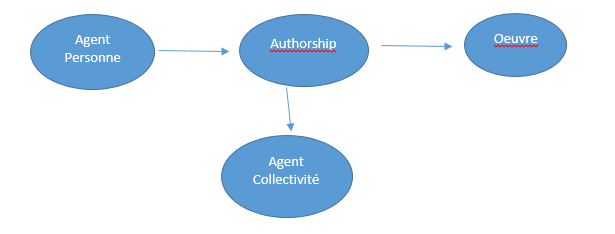
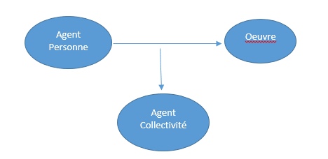

# Documentation humaine de l’XSLT rdf2pivot

## Le RDF produit à l’ABES

Les données RDF produites à l’ABES concernent des métadonnées issues du projet ISTEX d’achat centralisé de lots de revues et livres électroniques, pour lesquelles on dispose des niveaux inférieurs habituellement non décrits dans le MARC mais présents sur les plateformes des éditeurs (articles, volumes, numéros ainsi que chapitres). Ces données résultent de conversion des fichiers XML reçus des éditeurs en un modèle homogène qui s’inspire du modèle FRBR et est de type entité/relation décrit ici : http://documentation.abes.fr/aidescienceplusabes/index.html#ModeleDonnees).

## Adaptations du modèle 

Contrairement aux données issues du TEF, du MARC et du KBART, les informations ne se présentent pas dans des enveloppes qu’il faudrait décomposer en entités. Les entités existent déjà, elles se présentent de façon autonome et au même niveau. 

L’XSLT commence par déterminer le type de l’entité (au moyen de rdf:type) et récupère son ID. C’est le seul cas de données natives où ce n’est pas l’XSLT qui forge les ID mais où on s’appuie sur le nommage d’origine.

Les principales modifications pour passer du RDF “ABES” au RDF “sudoc21” sont :
    - création des niveaux Expression et Item
    - arbres O-M-I pour les volumes et fascicules des revues
    - suppression de l’entité Authorship

### Modification du tronc OEMI

Les entités Expressions sont créées à partir des entités de type Oeuvre. L’ID d’une Expression est construit à partir de l’ID de l’Oeuvre en reprenant la racine commune : par exemple, si on a `<http://hub.abes.fr/brepols/ebook/101484mtemaeb5107186/w>` on va construire l’Expression `<http://hub.abes.fr/brepols/ebook/101484mtemaeb5107186/e>`  . L’Expression récupère deux propriétés de l’Oeuvre : la langue et la date de modification (qui correspondrait à une version révisée d’un article). 

Les entités Items sont créées à partir des entités de type Manifestation. L’ID de la Item dérive de celui de la Manifestation de la même manière que décrit plus haut. L’Item récupère comme propriétés le DOI et/ou l’URI. 

Les volumes et les fascicules de publications en série étaient décrits dans le RDF ABES uniquement au niveau Oeuvre. Dans ces deux cas, l’entité Oeuvre ne donne pas lieu à la création d’une Expression comme décrit plus haut mais à une Manifestation (liée par la relation A_POUR_MANIFESTATION_SS_E). On ne crée d’Item que s’il existe un DOI ou une URI au volume. 

Transformations des contributions

L’entité Authorship a été créée dans le RDF ABES pour faire porter les relations d’affiliations lorsqu’un auteur a écrit un article ou un chapitre en tant que membre affilié à une institution. Il s’agit d’une forme de réification. 

L’XSLT rapatrie les informations portées par l’entité Authorship au niveau de l’entité Oeuvre qui va avoir de nouvelles relations. La relation A_POUR_CONTRIBUTEUR entre l’Oeuvre et l’Agent possède des propriétés (role, rang et rang par role) et une relation A_POUR_AFFILIATION. 

_Modèle RDF ABES : _

_Modèle RDF SUDOC 21 PIVOT :_

