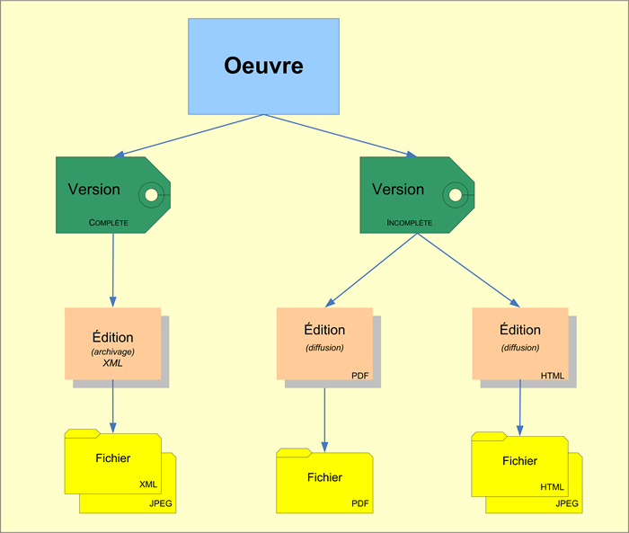
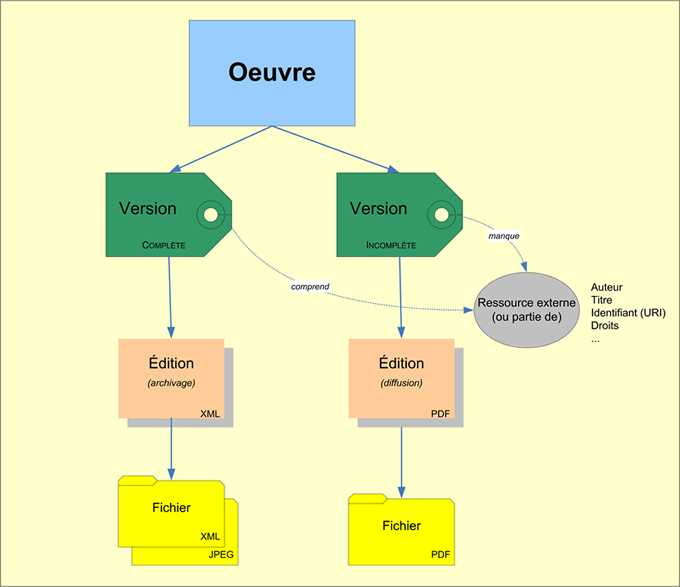
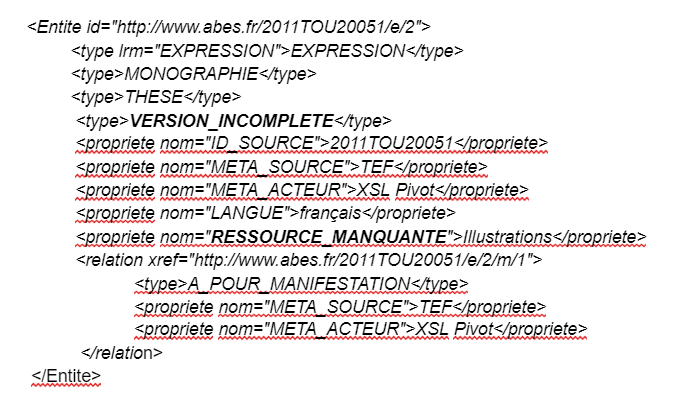
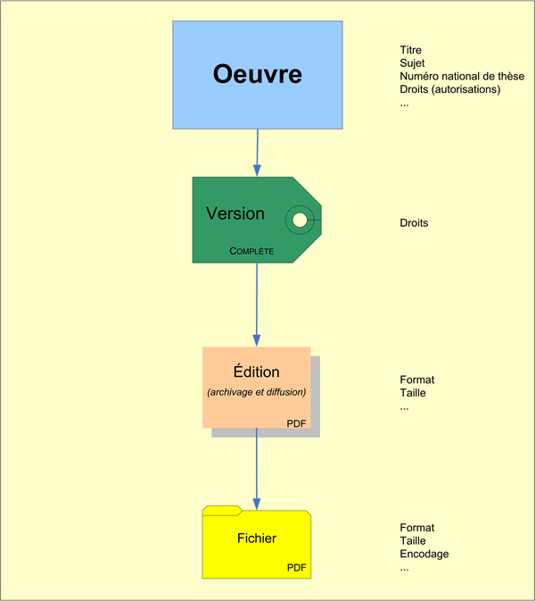

# Documentation humaine de l'XSLT tef2pivot
https://github.com/abes-esr/abes-format-pivot/blob/main/tef2pivot.xsl

## La recommandation TEF

_"La recommandation TEF (Thèses Electroniques Françaises) définit un jeu de métadonnées pour les thèses électroniques soutenues en France. Son objectif est d'organiser de manière cohérente des métadonnées de thèse riches et normalisées, afin de faciliter leur échange et leur diffusion, au niveau national ou international. Ces métadonnées recouvrent des métadonnées descriptives (bibliographiques) et des métadonnées de gestion (administration, droits, conservation)._

_Cette recommandation propose à la fois une modélisation de ces métadonnées et un format XML. Ce format est un format d'échange et un outil de validation. Il consiste en un schéma XML qui permet de spécifier la structure et le contenu d'une notice TEF, auquel s'ajoutent des règles de validation Schematron qui expriment avec précision les contraintes propres à TEF, qui elles-mêmes reflètent les textes réglementaires nationaux qui organisent le circuit des thèses électroniques. Ce format XML s'appuie sur le schéma METS qui permet d'articuler les différents types de métadonnées._

_En s'appuyant sur METS et Schematron, TEF n'est pas tant un nouveau format qu'une structure modulaire et souple qui pourra s'adapter aux évolutions du cadre réglementaire ou à un contexte d'utilisation particulier. “_ 
[https://www.theses.fr/schemas/tef/recommandation/index.html](https://www.theses.fr/schemas/tef/recommandation/index.html)

## Genèse de l’XSL

Cet XSL est le premier à avoir été écrit. Il a permis de développer les mécanismes qui sous tendent le format pivot ainsi qu’une partie du son vocabulaire. Cependant le pivot s’est “affiné” lorsqu’on s’est confronté aux autres sources sans que l’on revienne sur cette “première mouture” d'où la présence de quelques spécificités propre à ce format : non prise en compte de l’entité Item, traitement partiel de l’indexation Rameau.

## Adaptations du modèle TEF au tronc OEMI

Les données sont, contrairement aux autres sources, complètement LRMisées : chaque fichier contient tout un ensemble OEMI : une oeuvre, une ou deux expressions au maximum (pour le TEF issu de STAR), appelées dans ce contexte “version complète” / “version incomplète”, et une ou plusieurs manifestations (ou “éditions”, en fonction des formats : ici seules les manifestations électroniques sont signalées. Et des fichiers correspondant aux items.
Toutefois les items n’ont pas été convertis en format pivot.
Toutes les entités ont un sous-type “Thèse”.

_Structure FRBR de TEF_

Le nommage des entités a été construit sur le NNT (identifiant national de thèse), qui est propre à chaque oeuvre, et donc peut être décliné facilement pour toutes les entités OEMI.

#### Expressions

Appelées “versions” dans TEF, elles s’appuient sur la notion de thèse “complète” ou “incomplète”. On peut avoir ou non le détail des différences, qui peuvent être précisées en notes.

_Versions complète / incomplète_

Les expressions de thèses ont un sous type “Version complète” ou “Version incomplète”. La “version incomplète” peut porter une information sur son “incomplétude” dans la propriété “RESSOURCE_MANQUANTE”.

_Expression manquante_

## Contributions

Toutes les contributions sont des liens vers des identifiants idRef, et toutes au niveau de l'œuvre. En revanche, un même contributeur peut apparaître avec plusieurs rôles (exemple : le directeur de thèse est souvent également membre du jury. Dans ce cas, on a une contribution par rôle.

## Indexation

L’indexation sujet est présente sous forme de mots-clés et d’indexation Rameau. On n’a conservé ici que les points d’accès (“têtes de vedettes”), et non les subdivisions. Les points d’accès Rameau sont convertis en relations “A_POUR_SUJET”, tandis que les mots clés sont traduits en propriété “KEYWORD”.

## Droits

Les droits sont une notion clé dans TEF. Ils peuvent être associés à l'œuvre, mais aussi à l’expression. Toutefois, on a laissé de côté cet aspect, qui n’était pas ou peu présent dans les autres sources.

_Propriétés attachées à chaque niveau FRBR de TEF_

