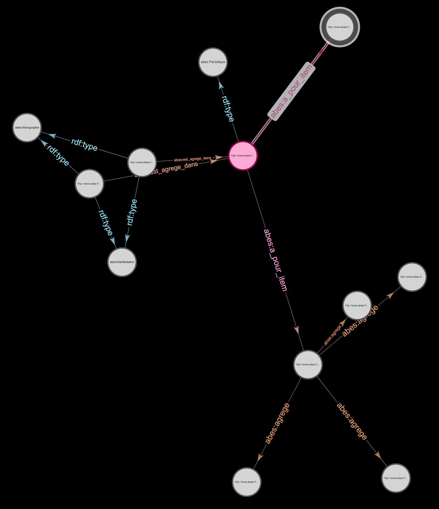

# # Documentation humaine de l’XSLT marcEtatColl2pivot
https://github.com/abes-esr/abes-format-pivot/blob/main/etatColl2pivot.xsl

## Contexte Sudoc21 

Nous avons fait le choix d’expérimenter la récupération des données recalculées et structurées pour l’interface Périscope (qui sont stockées dans une base Oracle dédiée) plutôt que les zones des notices MARC pour les états de collection des publications en série signalés dans l’échantillon Marc du Sudoc.

Il a été envisagé de récupérer en plus l’état de collection concaténé des données Marc (zones 955$r et 959$r) pour une meilleure lisibilité et faciliter les comparaisons mais nous ne l’avons finalement pas fait.

Les limites de ce choix :
    - Limitation de la granularité à l’année (choix fait dans Périscope) - on ne récupère donc pas les infos qui peuvent être présentes dans les notices MARC et qui sont plus précises (au mois, au trimestre, au numéro, au volume.. par exemple)
    - Le format des données reste textuel. Les données ne sont pas en format date.

## Détails techniques

Export de Périscope parsé à partir de la liste des PPNs de l’échantillon ; on récupère donc un fichier .XSL par PPN.

Chaque exemplaire est séquencé selon la complétude de la collection et ces informations sont raccrochées au niveau Item par l’XSLT dans le pivot exprimé en XML.

*Exemples d’exports Périscope : *
Un même Item peut présenter plusieurs séquences discontinues mais toujours dans l’ordre chronologique.

| Possesseur | Lacunes ou pas   | année début | année fin | 
|--|--|--|- -|
| RCR 751052105 | Collection sans information de lacunes | 1938 | 2014 |
| RCR 751052105 | Collection sans information de lacunes | 2017 | 2021 |
| PCP Philosophie Membre du plan de conservation | 751052116 | Collection sans information de lacunes | 1939 | 1953 |	
| PCP Philosophie Membre du plan de conservation | 751052116 | Collection lacunaire | 1954 | 1954 |
| PCP Philosophie Membre du plan de conservation | 751052116 | Collection sans information de lacunes | 1955 | 2021 |
| PCP Philosophie Membre du plan de conservation | 751052131 | Collection sans information de lacunes | 1938 |	1960 | 
| PCP Philosophie Membre du plan de conservation | 751052131 | Collection sans information de lacunes | 1976 |	1976 |
| PCP Philosophie Membre du plan de conservation | 751052131 | Collection sans information de lacunes | 1988 |	1989 |
| PCP Philosophie Membre du plan de conservation | 751052131 | Collection sans information de lacunes | 1991 |	1991 |

NB : La mention « collection lacunaire » dans Périscope est générée de 3 façons différentes :
    - pour tout l’Item lorsque la notice MARC ne fournit pas le le détail des lacunes)
    - sur des bouts de l’état de collection (séquences) lorsque les lacunes sont précisément et explicitement signalées dans la notice MARC
    - par calcul de Périscope qui se base sur la structuration de l’état de collection lorsqu’il est détaillé par numéro au sein d’une année (ex : vol.1 n.1 (jan-1919) ; vol.1 n.3 (jul-1919))

## Informations dans le fichier XML

Puis, l’ensemble des fichiers .XLS a été rassemblé et converti en un fichier XML au moyen d’OpenRefine. Les informations récupérées en XML sont les suivantes : PPN, RCR, EPN, Etat (C pour Complet ou L pour Lacunaire), Année de début, Année de fin.

*Exemple pour une notice bibliographique (un seul PPN) avec plusieurs exemplaires (numéros EPN) qui sont possédées par différentes bibliothèques (identifiées par leur numéro RCR) : *

A la racine, on va construire un ID du bouquet qui va être réutilisé pour forger les ID de toutes les entités du bouquet. Cet ID normalisé commence par la racine `http://www.abes.fr/kbart/` suivi du nom du bouquet qui désigne le corpus en utilisant le nom de l’éditeur. On crée une entité de type ENSEMBLE et BOUQUET.
`<holdings id="PPN_Echantillon-Sudoc-1186r32A001_PS">

   <ligne>

      <PPN>00102597X</PPN>

      <RCR>141182202</RCR>

      <EPN>417693389</EPN>

      <type>RCR</type>

      <etat>C</etat>

      <debut>1996</debut>

      <fin>1996</fin>

   </ligne>

   <ligne>

      <PPN>00102597X</PPN>

      <RCR>141182202</RCR>

      <EPN>417693389</EPN>

      <type>RCR</type>

      <etat>C</etat>

      <debut>2003</debut>

      <fin>2006</fin>

   </ligne>

   <ligne>

      <PPN>00102597X</PPN>

      <RCR>141182202</RCR>

      <EPN>417693389</EPN>

      <type>RCR</type>

      <etat>C</etat>

      <debut>2008</debut>

      <fin>2020</fin>

   </ligne>

   <ligne>

      <PPN>00102597X</PPN>

      <RCR>315552102</RCR>

      <EPN>115236031</EPN>

      <type>RCR</type>

      <etat>C</etat>

      <debut>1972</debut>

      <fin>1972</fin>

   </ligne>

   <ligne>

      <PPN>00102597X</PPN>

      <RCR>315552102</RCR>

      <EPN>115236031</EPN>

      <type>RCR</type>

      <etat>C</etat>

      <debut>1980</debut>

      <fin>1981</fin>

   </ligne>

   <ligne>

      <PPN>00102597X</PPN>

      <RCR>315552102</RCR>

      <EPN>115236031</EPN>

      <type>RCR</type>

      <etat>C</etat>

      <debut>1997</debut>

      <fin>2020</fin>

   </ligne>

   <ligne>

      <PPN>00102597X</PPN>

      <RCR>341726101</RCR>

      <EPN>65526423X01</EPN>

      <type>RCR</type>

      <etat>L</etat>

      <debut>1962</debut>

      <fin>1981</fin>

   </ligne>

   <ligne>

      <PPN>00102597X</PPN>

      <RCR>384212101</RCR>

      <EPN>110812174</EPN>

      <type>RCR</type>

      <etat>C</etat>

      <debut>1962</debut>

      <fin>2020</fin>

   </ligne>
`   

## Détails de la modélisation dans le pivot 

Un état de collection continu par exemple : « j’ai toute la collection de 1978 à 2020 » est rattaché directement au niveau de l’Item. L’ID de l’Item est basé sur l’EPN. L’Item a pour propriété “date_debut”  avec la valeur “1978” ainsi que la propriété “date_fin” avec la valeur “2020”.

Toute ligne discontinue (qu’il s’agisse de lacunes ou d’interruptions) est quant à elle répartie à un niveau inférieur dans la modélisation : les séquences. L’ID de la séquence est construit sur l’EPN auquel on rajoute /seq avec un numéro incrémental. Toutes les séquences sont reliées à un Item. Chaque séquence a pour propriété “date_debut” et “date_fin”. La relation d’un Item à ses séquences est “agrège”. 

